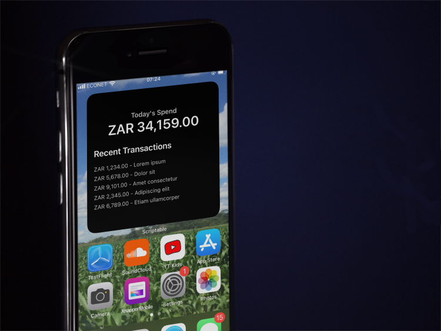

# Track My Spend
An iOS widget that helps you track your spend with Programmable Banking. 

- TrackMySpend shows you how much money you have spent each day and provide a view of your last 5 transactions on your account.
- The widget can be installed on an iOS mobile device in a few simple steps.
- TrackMySpend uses the **Programmable Banking Transaction History API**.

## Requirements
- The [Scriptable](https://scriptable.app/) mobile app
- iPhone/iPad/Mac
- iOS 14.0 or later / macOS Big Sur or later
- Access to the [Investec Programmable Banking API](https://developer.investec.com/za/api-products)

## Preparation
You will need to have your Investec API keys at hand.
Specifically, your client ID, client secret and API key. You can learn more about getting your Investec API keys in the [API Quick Start Guide](https://offerzen.gitbook.io/programmable-banking-community-wiki/developer-tools/quick-start-guide#how-to-get-your-api-keys).

## Getting Started
We encourage you to fork this repository to your GitHub account. This allows you to easily stay up to date with new changes to the widget without losing any local customizations you may make to it. To fork this app, please see the [following guide](https://docs.github.com/en/get-started/quickstart/fork-a-repo).

Once you have forked the repo, please clone it.
After you have cloned the repository, clone the repository to your local environment.

## Configuration
Open the `src/widget.js` file and add your API credentials according to the instructions in the file.

## Device Installation

- Create a new script in Scriptable. This opens up the editor on your iPhone. You can give it any title as you wish.
- Use your [Universal Clipboard](https://support.apple.com/en-us/HT209460) to copy the contents of `widget.js` to the editor on your iPhone.
- Tap *Done* to save the script.

## Configure The Widget

- Long-press on your home screen and select the option to add a new widget.
- Select the Scriptable app.
- Select the largest widget size.
- Long press the new widget and select *Edit Widget*.
- Choose the script you created.

That's it!

## 📄 License

This project is MIT licensed, as found in the [LICENSE][l] file.
